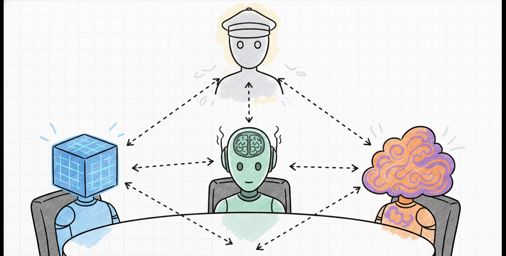
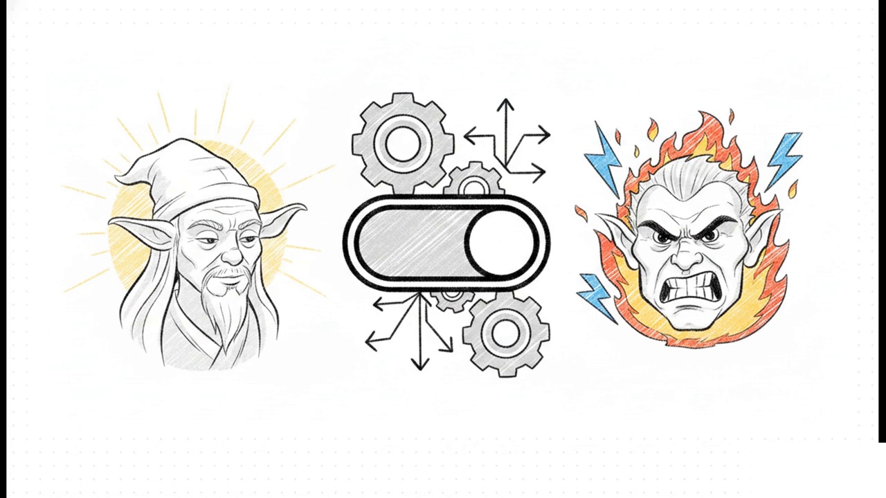
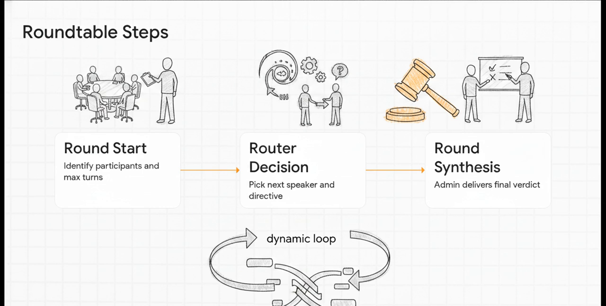
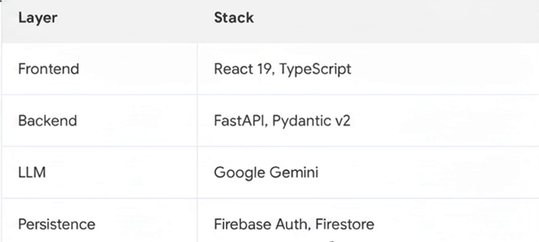

# Master Yoda's Holocron — SW Themed AI Chat Hub



A Star Wars–themed LLM playground with two experiences:

1. **Single Chat** — talk to Master Yoda or Darth Ragebaiter across three modes (`roast`, `translate`, `wisdom`), with a Light/Dark ("unhinged") tone switch, TTS, and synthesized SFX.

   

2. **The Roundtable** — seat 3 of 5 personas (Yoda, Ragebaiter, Chancellor Palpaccio, AN-LYT "Anna", Dinn Korr) at a table in **Boardroom** or **Pitch** mode. A master-admin agent on a fast model (`gemini-3.1-flash-lite`) reads each user message and hands the floor to one or several characters; each turn is a structured LLM call that also emits a memory delta, and when the admin judges the debate settled it closes the round with a synthesized decision or verdict. Every character keeps its own persistent knowledge graph (beliefs, relationships, stances) that carries across sessions.

Live demo target: React 19 SPA (Vite) + FastAPI backend, Firebase Auth/Firestore for cloud sync, Google Gemini as the default model provider with pluggable OpenAI-compatible providers (OpenRouter, local gateways, etc).

## Architecture

```
┌─────────────────────────┐        /api/*  (Vite dev proxy → :8000)      ┌──────────────────────────┐
│  frontend/  (React+TS)  │ ────────────────────────────────────────────▶│  backend/   (FastAPI)     │
│  Vite, Tailwind, Motion │ ◀──────────────────────────────────────────  │  google-genai, httpx      │
└─────────────┬────────────┘        JSON  /  NDJSON stream               └─────────────┬──────────────┘
              │                                                                        │
              ▼                                                                        ▼
      Firebase Auth + Firestore                                            Google Gemini API
      (sessions, character memory                                          — or any OpenAI-compatible
       graphs, roundtable transcripts)                                     endpoint (BYO base URL + key)
```

- The backend is stateless per request — it **never persists** anything. The frontend sends each character's current memory graph on every roundtable call and owns merging/persisting the deltas the backend returns (localStorage for guests, Firestore per-user when signed in).
- `GEMINI_API_KEY` unset (or left as the placeholder) → both endpoints degrade gracefully to canned offline responses instead of failing, so the app is demoable with zero config.

### Roundtable pipeline



Per user message the master admin runs one **Round Start → Router Decision → Round Synthesis** cycle: it identifies the seated participants, hands the floor to 1–3 speakers with a directive each, and — once the debate has settled (≥3 turns) — closes with a synthesized verdict.

## Features

- **Two chat personas**, each with roast / translate / wisdom modes and a "dark side" unhinged toggle that swaps the whole prompt + UI theme.
- **The Roundtable**: 3-seat multi-agent debate. Per user message the master admin picks 1–3 responders — replying sequentially (reacting to each other) or in parallel (UI toggle) — and decides whether to close the round. NDJSON-streamed turn-by-turn (`round_start` → `router_decision` → `turn_start` → `memory_recall` → `turn_complete` → … → `round_synthesis` → `round_end`).
- **`@name` direct reply** — addressing one seated character by name (`@dinn ...`) skips the router/synthesis loop entirely for a single one-off reply.
- **Per-character graph memory** — nodes (`character` / `concept` / `project` / `event` / `belief`) and typed edges with stance/salience, recalled deterministically per turn (salience + recency + keyword overlap, no extra LLM call) and rendered into that character's system prompt in first person.
- **Bring-your-own-provider** — point every call at any OpenAI-compatible `/chat/completions` endpoint (OpenRouter, a local gateway, etc.) via a custom base URL + API key, bypassing Gemini entirely.
- **Cloud sync** — Google/GitHub sign-in via Firebase Auth; chat sessions, character memory graphs, and roundtable transcripts sync to Firestore under `users/{uid}/...` (rules restrict each user to their own subtree).
- **Offline-first fallback** — quota exhaustion or an unconfigured key never hard-fails the UI; both endpoints fall back to hand-written in-character lines.
- **Client-side flavor**: procedurally generated SFX/lightsaber hum via the Web Audio API, and character-flavored `SpeechSynthesis` TTS — no audio assets required.

## Tech stack



<sub>Frontend also uses Vite 6, Tailwind CSS v4, Motion (Framer Motion), lucide-react · Backend uses the `google-genai` SDK, httpx, Uvicorn · Gemini models `gemini-2.5-flash/pro` & `gemini-3.5-flash` by default, with any OpenAI-compatible provider as an alternative · `localStorage` for guest/offline state.</sub>

## Project structure

```
backend/
  app/
    main.py                  FastAPI app, CORS, router mount
    api/endpoints.py         POST /api/yoda/generate, POST /api/roundtable/generate
    models/
      schemas.py             Single-chat request schema
      roundtable_schemas.py  Graph memory, delta, router/turn/synthesis schemas
    services/
      characters.py          Persona registry (voice, roles, temperature, offline lines)
      prompts.py              Single-chat system-instruction builder
      roundtable_prompts.py   Router / turn / synthesis prompt builders
      llm_service.py          Gemini + OpenAI-compatible callers (sync + structured-output)
      memory.py                Deterministic subgraph recall + delta sanitization
      orchestrator.py          Roundtable turn loop (router → turn → synthesis), NDJSON events
frontend/
  src/
    App.tsx                  Top-level state, auth, session sync, single-chat flow
    components/               ChatHistory, InputArea, YodaGlobe (reactive mascot)
    components/roundtable/    RoundtablePanel, RosterPicker, RoundtableTranscript,
                               MemoryGraphInspector, AvatarChips, SynthesisCard, FlippableReply
    lib/
      characters.ts           Frontend persona metadata + `@mention` parsing
      firebase.ts              Auth + Firestore read/write helpers
      memoryGraph.ts           Delta merge, decay/prune, guest-memory localStorage
      roundtableStream.ts      NDJSON stream reader/dispatcher
    utils/audio.ts             Web Audio SFX + SpeechSynthesis TTS engine
firestore.rules                Per-user isolation: users/{uid}/** readable/writable only by that uid
```

## Setup

### Prerequisites
- Node.js 18+
- Python 3.10+
- A Gemini API key ([Google AI Studio](https://aistudio.google.com/)) — optional, app runs offline without one
- A Firebase project with Auth (Google + GitHub providers) and Firestore enabled — optional, app runs guest-only without one

### Backend

```bash
cd backend
python -m venv .venv
.venv\Scripts\activate        # Windows
pip install -r requirements.txt
cp .env.example .env          # set GEMINI_API_KEY
python -m uvicorn app.main:app --reload --port 8000
```

### Frontend

```bash
cd frontend
npm install
cp .env.example .env          # set VITE_FIREBASE_* (optional — guest mode works without it)
npm run dev                   # Vite dev server, proxies /api → http://127.0.0.1:8000
```

Build for production with `npm run build`; type-check with `npm run lint` (runs `tsc --noEmit`).

## Environment variables

**`backend/.env`**

| Var | Required | Notes |
|---|---|---|
| `GEMINI_API_KEY` | No | Omit to run fully offline (canned fallback replies) |
| `APP_URL` | No | Unused by current code paths |

**`frontend/.env`**

| Var | Required | Notes |
|---|---|---|
| `VITE_FIREBASE_API_KEY` / `_AUTH_DOMAIN` / `_PROJECT_ID` / `_STORAGE_BUCKET` / `_MESSAGING_SENDER_ID` / `_APP_ID` | No | Omit to disable sign-in; sessions stay in `localStorage` only |
| `VITE_FIRESTORE_DATABASE_ID` | No | Defaults to `(default)` |

A per-user Gemini key and/or a custom OpenAI-compatible base URL can also be set at runtime from the UI (stored in `localStorage`, sent per-request as `customApiKey` / `providerBaseUrl`) — no rebuild required.

## API reference

### `POST /api/yoda/generate`
Single-character chat turn.

```jsonc
// request
{
  "text": "roast my code", "mode": "roast", "character": "yoda",
  "isUnhinged": false, "customApiKey": null, "providerBaseUrl": null,
  "selectedModel": "gemini-3.5-flash", "history": [{"id","sender","text"}],
  "ragebaitLevel": 0.5, "responseLength": "medium"
}
// response
{ "reply": "...", "isFallback": false, "actualModelUsed": "gemini-3.5-flash", "modelFallbackOccurred": false }
```
Falls back to a canned reply (`isFallback: true`, `fallbackReason: "KEY_UNCONFIGURED" | "QUOTA_EXCEEDED"`) instead of erroring on missing keys or provider rate limits.

### `POST /api/roundtable/generate`
Multi-character round, streamed as **NDJSON** (`application/x-ndjson`, one JSON event per line).

```jsonc
// request
{
  "text": "should we rewrite the backend in Rust?", "mode": "boardroom",
  "participants": [{ "characterId": "yoda", "memory": { "characterId","version","nodes","edges" } }, /* x3 */],
  "history": [{"id","sender","text"}],
  "parallelReplies": false,   // true: chosen speakers reply concurrently, blind to each other
  "targetCharacterId": null   // set to bypass the admin for a single @name reply
}
```

One master-admin call per user message (on `gemini-3.1-flash-lite`; the user-selected model with a custom provider) decides which 1–3 seated characters respond, their directives, and whether to close the round — closing is only allowed once the transcript holds ≥3 character turns.

Event stream, in order:

| Event | Payload |
|---|---|
| `round_start` | `mode`, `participants`, `maxTurns` (= number of admin-chosen turns) |
| `router_decision` | one per chosen speaker — `next_speaker`, `directive`, admin `reasoning` on the first |
| `turn_start` | `speaker`, `turnIndex`, `directive` |
| `memory_recall` | `speaker`, recalled `nodeIds`/`nodeLabels` for that turn |
| `turn_complete` | `innerThought` (hidden), `publicReply`, `stanceScore`, `memoryDelta` |
| `turn_error` | LLM call failed this turn — `fallbackReply` used instead |
| `round_synthesis` | only when the admin closes the round — Boardroom `decision`/`rationale`/`actionItems`/`dissent`, or Pitch `verdict`/`scorecard`/`summary` |
| `round_end` | `turnsTaken` |
| `error` | Unrecoverable stream-level failure |

Exactly 3 distinct, known character IDs must be seated. In parallel mode each character call carries a 90s hard timeout so one stalled request can't dead-air the stream.

## Known constraints

- Gemini free-tier keys are rate-limited project-wide; the backend retries once after a 20s backoff on burst-limit errors, then degrades to offline lines.
- Model allowlists (`endpoints.py`) hard-reject unknown model names when using Gemini directly — irrelevant once a custom `providerBaseUrl` is set, since provider catalogs are arbitrary.
- The frontend has no `@types/react` package installed; custom components can't take a `key` prop directly — wrap repeated elements in a keyed `<Fragment>` instead.


Thats all, have great day and thanks for reading
